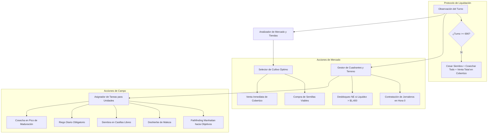

# 🌾 Kaggriculture: Simulación y Estrategia Económica de Granjas

[](https://www.kaggle.com/competitions/kaggriculture)
[](https://www.python.org/)
[](https://github.com/Kaggle/kaggle-environments)
[](LICENSE)

Solución y arquitectura de agente estratégico para la competición oficial de Kaggle **Kaggriculture** (*Featured Competition*, \$50,000 USD en premios). Dos granjeros compiten simultáneamente durante una temporada de 30 días (720 turnos) para maximizar sus monedas mediante el cultivo, cría de ganado, gestión de jornaleros y venta en un mercado dinámico de oferta y demanda.

---

## 📊 Resumen de Rendimiento (Benchmark Local)

| Enfrentamiento | Partidas | Victorias Agente | Victorias Rival | Tasa de Victoria | Monedas Medias Agente | Monedas Medias Rival | Margen Medio |
| :--- | :---: | :---: | :---: | :---: | :---: | :---: | :---: |
| **IndustrialAgent v3 vs Industrial v2** | 6 | **6** | 0 | **100.0%** | **\$56,066** | \$23,305 | **+\$32,761** |
| **IndustrialAgent v3 vs Heuristic v1** | 6 | **6** | 0 | **100.0%** | **\$59,673** | \$6,552 | **+\$53,121** |
| **IndustrialAgent v2 vs Heuristic v1** | 6 | **6** | 0 | **100.0%** | **\$31,457** | \$8,562 | +\$22,895 |
| **HeuristicAgent v1 vs Starter Baseline** | 6 | **6** | 0 | **100.0%** | **\$5,311** | \$3,321 | +\$1,990 |

---

## 🎮 Mecánicas de Juego y Economía

### 1. Estructura Temporal y Espacial
* **Temporada:** 30 días con 24 horas/turnos por día = **720 turnos totales**.
* **Terreno:** Cuadrícula de $10 \times 10$ dividida en cuatro cuadrantes de $5 \times 5$.
  * Se inicia únicamente con el cuadrante **NW** desbloqueado (25 casillas).
  * Los cuadrantes **NE**, **SW** y **SE** pueden desbloquearse con `BUY_LAND` por \$1,000, \$2,000 y \$4,000 respectivamente.
* **Cobertizo (Shed):** Ubicado en el centro `(4,4)`, `(5,4)`, `(4,5)`, `(5,5)`. Capacidad máxima de 100 productos (las semillas tienen ranura propia sin límite).

### 2. Tabla de Cultivos y Ganado

| Recurso | Tipo | Coste Semilla | Precio Base | Maduración 1ª Cosecha | Cosecha Máxima | Rendimiento Máximo | Consumo en Tiendas del Pueblo |
| :--- | :---: | :---: | :---: | :---: | :---: | :---: | :--- |
| **Zanahoria (Carrot)** | Única | \$20 | \$35 | 2 días | 3 días | 4 (3 sin fertilizar) | Pet Cafe (2x), Farmers Market |
| **Trigo (Wheat)** | Única | \$10 | \$25 | 2 días | 4 días | 6 (4 sin fertilizar) | Bakery, Pizza Shop, Brunch, Ice Cream |
| **Tomate (Tomato)** | Recurrente | \$50 | \$60 | 8 días | 11 días | 4 recogidas | Pizza Shop, Farmers Market |
| **Fresa (Strawberry)** | Recurrente | \$100 | \$120 | 10 días | 16 días | 4 recogidas | Brunch, Ice Cream, Smoothie |
| **Melón (Melon)** | Única | \$80 | \$250 | 10 días | 12 días | 6 unidades | Ninguna tienda (precio colapsa fácil) |
| **Oca / Huevo** | Animal | \$300 | \$50 | 4 días | Diaria | 4 retenidos | Bakery, Brunch Spot |
| **Vaca / Leche** | Animal | \$400 | \$160 | 8 días | Cada 2 días | 6 retenidos | Pizza, Ice Cream, Smoothie |
| **Oveja / Lana** | Animal | \$500 | \$200 | 6 días | Cada 3 días | 6 retenidos | Yarn Store (2x) |

### 3. Función de Precios del Mercado Dinámico
El precio de venta varía según el inventario del mercado ($I_0 = 10,000$ inicial):
$$P(inv) = \text{base} \pm \text{amp} \cdot f(|inv - I_0|)$$

* **Escasez ($inv < I_0$):** Los precios suben según funciones `sqrt`, `log` o `hinge`.
* **Saturación ($inv > I_0$):** Los precios bajan (productos premium como melones o fresas colapsan rápidamente a \$1 por funciones cuadráticas `sq` o lineales agresivas).
* **Consumo Urbano:** Cada 3 días el pueblo desbloquea tiendas aleatorias que drenan existencias del mercado cada 4 turnos, impulsando los precios al alza.

---

## 🧠 Arquitectura de la Solución (`HeuristicAgent v1`)

El agente implementa una arquitectura modular con toma de decisiones jerárquica en tiempo real:



### Principales Innovaciones del Agente:
1. **Planificación de Tareas Priorizada:**
   - Prioridad 4: Cosechar cultivos en madurez máxima (`age >= max_yield_day`).
   - Prioridad 3: Regar plantas pendientes (`watered_today == False`).
   - Prioridad 2: Sembrar en casillas libres accesibles.
   - Prioridad 1: Deshierbar casillas infectadas con maleza (`DIG`).
2. **Coordinación Multi-Unidad:**
   - Empleo del granjero principal y jornaleros contratados (`hands`) con reclamo de casillas para evitar colisiones y duplicación de acciones.
   - Contratación de mano de obra barata (\$1 y \$2 por jornalero según la serie de Fibonacci) en la hora 0 de cada día.
3. **Expansión Territorial:**
   - Desbloqueo del cuadrante NE (\$1,000) cuando la liquidez supera los \$1,400 antes del día 20, duplicando el área de siembra a 50 casillas.
4. **Protocolo Fin de Temporada (Liquidación Total):**
   - A partir del día 28 cesa la siembra de cultivos lentos.
   - En las últimas 24 horas se cosecha todo el campo y se canaliza al cobertizo para liquidación masiva en mercado, ya que los productos no vendidos al turno 720 otorgan \$0.

---

## 📁 Estructura del Proyecto

```text
06_kaggriculture/
├── README.md                 # Esta documentación técnica
├── main.py                   # Agente autónomo autocontenido para envío a Kaggle
├── evaluate.py               # Benchmark de simulación contra baselines
├── submit.py                 # Script de validación y envío a Kaggle API
│
├── simulator/                # Motor de simulación autónomo (zero-dependency)
│   ├── __init__.py
│   ├── engine.py             # Reglas oficiales, mercado, turnos y refresco diario
│   └── battle.py             # Ejecutor de partidas 1v1 y torneos con métricas
│
└── src/                      # Código fuente modular
    ├── __init__.py
    ├── heuristic_agent.py    # Implementación del agente estratégico
    └── starter_baseline.py   # Agente baseline oficial de Kaggle (Carrot Loop)
```

---

## 🚀 Guía de Uso y Comandos

### 1. Ejecutar el Benchmark de Evaluación Local
Ejecuta torneos de simulación completos de 720 turnos midiendo velocidad y tasa de victorias:

```powershell
.\.venv\Scripts\python.exe 06_kaggriculture\evaluate.py
```

### 2. Enviar el Agente a Kaggle Leaderboard
El script `submit.py` ejecuta una verificación local de 72 pasos antes de enviar `main.py` mediante la API de Kaggle:

```powershell
.\.venv\Scripts\python.exe 06_kaggriculture\submit.py "Heuristic Strategic Agent v1"
```

### 3. Consultar Estado de Envíos y Episodios en Kaggle CLI
```powershell
.\.venv\Scripts\kaggle.exe competitions submissions kaggriculture
```

---

## 📈 Hoja de Ruta y Próximas Mejoras (v2)

- [ ] **Modelo de Predicción de Precios Dinámico:** Anticipar saturaciones de mercado y vender en picos antes del colapso de precios.
- [ ] **Ganadería Intensiva:** Incorporar coops de ocas (huevos con demanda urbana fija) y pastos de vacas/ovejas con rotación de trigo y colecta de fertilizante.
- [ ] **Fertilización Óptima:** Usar el fertilizante acumulado de animales para duplicar el rendimiento de cultivos de alto valor (melones y zanahorias en pet cafes).
- [ ] **Pathfinding A\* con Evasión de Obstáculos:** Optimizar los movimientos de granjeros y jornaleros minimizando pasos ociosos.
