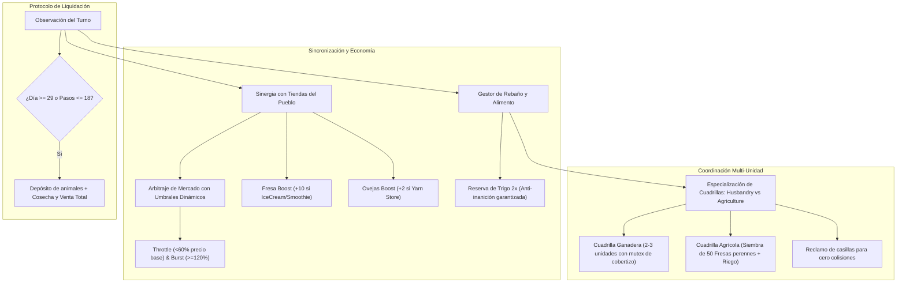

# 🌾 Kaggriculture: Simulación y Estrategia Económica de Granjas

[](https://www.kaggle.com/competitions/kaggriculture)
[](https://www.kaggle.com/competitions/kaggriculture)
[](https://www.python.org/)
[](https://github.com/Kaggle/kaggle-environments)
[](LICENSE)

Solución y arquitectura de agente estratégico para la competición oficial de Kaggle **Kaggriculture** (*Featured Competition*, \$50,000 USD en premios). Dos granjeros compiten simultáneamente durante una temporada de 30 días (720 turnos) para maximizar sus monedas mediante el cultivo, cría de ganado, gestión de jornaleros y venta en un mercado dinámico de oferta y demanda.

El agente actual en producción es **Grandmaster Agent v11 Titan** (`main.py`), fruto de la optimización genética y auto-juego (*self-play*) masivo a través de más de 1,000 partidas simuladas en el módulo `mega_simulator`.

---

## 📊 Resumen de Rendimiento (Benchmark Local & Head-to-Head)

### 1. Duelos Espejo (*Mirror Duels*) vs Versiones Anteriores
Evaluación balanceada (intercambiando Jugador 0 y Jugador 1 en cada semilla para eliminar ventaja de turno inicial):

| Enfrentamiento | Partidas Espejo | Victorias v11 Titan | Victorias Rival | Tasa Victoria v11 | Media v11 Titan | Media Rival | Margen Neto Medio |
| :--- | :---: | :---: | :---: | :---: | :---: | :---: | :---: |
| **v11 Titan vs v11 Base (Endgame Churn Fix)** | 40 | **37** | 3 | **92.5%** | **\$58,353** | \$57,910 | **+\$443** |
| **v11 Titan vs v10 Supreme** | 40 | **30** | 10 | **75.0%** | **\$56,263** | \$54,844 | **+\$1,419** |
| **v11 Titan vs v8 Champion (573.3 Elo)** | 20 | **16** | 4 | **80.0%** | **\$55,378** | \$53,906 | **+\$1,472** |
| **v11 Titan vs v6 Squad Leader** | 40 | **22** | 18 | **55.0%** | **\$57,801** | \$57,714 | **+\$87** |

### 2. Torneos Oficiales vs Agentes Baseline Históricos (720 turnos completos)

| Enfrentamiento | Partidas | Victorias v11 Titan | Victorias Rival | Tasa de Victoria | Monedas Medias v11 | Monedas Medias Rival | Puntuación Máxima |
| :--- | :---: | :---: | :---: | :---: | :---: | :---: | :---: |
| **v11 Titan vs Industrial v3** | 6 | **6** | 0 | **100.0%** | **\$68,218** | \$30,245 | **\$101,740** |
| **v11 Titan vs Heuristic v1** | 4 | **4** | 0 | **100.0%** | **\$75,786** | \$5,700 | **\$101,238** |
| **v11 Titan vs Starter Baseline** | 4 | **4** | 0 | **100.0%** | **\$84,870** | \$3,602 | **\$97,507** |

---

## 🎮 Mecánicas de Juego y Economía

### 1. Estructura Temporal y Espacial
* **Temporada:** 30 días con 24 horas/turnos por día = **720 turnos totales**.
* **Terreno:** Cuadrícula de $10 \times 10$ dividida en cuatro cuadrantes de $5 \times 5$.
  * Se inicia únicamente con el cuadrante **NW** desbloqueado (25 casillas).
  * Los cuadrantes **NE**, **SW** y **SE** pueden desbloquearse con `BUY_LAND` por \$1,000, \$2,000 y \$4,000 respectivamente.
* **Cobertizo (Shed):** Ubicado en el centro `(4,4)`, `(5,4)`, `(4,5)`, `(5,5)`. Capacidad máxima de 100 productos (las semillas tienen ranura propia sin límite).

### 2. Tabla de Cultivos y Ganado

| Recurso | Tipo | Coste Semilla | Precio Base | Maduración 1ª Cosecha | Cosecha Máxima | Rendimiento Máximo | Consumo en Tiendas del Pueblo |
| :--- | :---: | :---: | :---: | :---: | :---: | :---: | :--- |
| **Zanahoria (Carrot)** | Única | \$20 | \$35 | 2 días | 3 días | 4 (3 sin fertilizar) | Pet Cafe (2x), Farmers Market |
| **Trigo (Wheat)** | Única | \$10 | \$25 | 2 días | 4 días | 6 (4 sin fertilizar) | Bakery, Pizza Shop, Brunch, Ice Cream |
| **Tomate (Tomato)** | Recurrente | \$50 | \$60 | 8 días | 11 días | 4 recogidas | Pizza Shop, Farmers Market |
| **Fresa (Strawberry)** | Recurrente | \$100 | \$120 | 10 días | 16 días | 4 recogidas | Brunch, Ice Cream, Smoothie |
| **Melón (Melon)** | Única | \$80 | \$250 | 10 días | 12 días | 6 unidades | Ninguna tienda (precio colapsa fácil) |
| **Oca / Huevo** | Animal | \$300 | \$50 | 4 días | Diaria | 4 retenidos | Bakery, Brunch Spot |
| **Vaca / Leche** | Animal | \$400 | \$160 | 8 días | Cada 2 días | 6 retenidos | Pizza, Ice Cream, Smoothie |
| **Oveja / Lana** | Animal | \$500 | \$200 | 6 días | Cada 3 días | 6 retenidos | Yarn Store (2x) |

### 3. Función de Precios del Mercado Dinámico
El precio de venta varía según el inventario del mercado ($I_0 = 10,000$ inicial):
$$P(inv) = \text{base} \pm \text{amp} \cdot f(|inv - I_0|)$$

* **Escasez ($inv < I_0$):** Los precios suben según funciones `sqrt`, `log` o `hinge`.
* **Saturación ($inv > I_0$):** Los precios bajan (productos premium como melones o fresas colapsan rápidamente a \$1 por funciones cuadráticas `sq` o lineales agresivas).
* **Consumo Urbano:** Cada 3 días el pueblo desbloquea tiendas aleatorias que drenan existencias del mercado cada 4 turnos, impulsando los precios al alza.

---

## 🧬 Arquitectura de la Solución: Grandmaster Agent v11 Titan

El agente opera mediante un cromosoma estratégico de 28 parámetros evolucionados en co-evolución competitiva:


```mermaid
flowchart TD
    A[Observación del Turno] --> B[Sinergia con Tiendas del Pueblo]
    A --> C[Gestor de Rebaño y Alimento]
    B --> D[Arbitraje de Mercado con Umbrales Dinámicos]
    C --> E[Especialización de Cuadrillas: Husbandry vs Agriculture]
    
    subgraph Sincronización y Economía
        B --> F1["Fresa Boost (+10 si IceCream/Smoothie)"]
        B --> F2["Ovejas Boost (+2 si Yarn Store)"]
        D --> F3["Throttle (<60% precio base) & Burst (>=120%)"]
        C --> F4["Reserva de Trigo 2x (Anti-inanición garantizada)"]
    end
    
    subgraph Coordinación Multi-Unidad
        E --> G1["Cuadrilla Ganadera (2-3 unidades con mutex de cobertizo)"]
        E --> G2["Cuadrilla Agrícola (Siembra de 50 Fresas perennes + Riego)"]
        E --> G3["Reclamo de casillas para cero colisiones"]
    end
    
    subgraph Protocolo de Liquidación
        A --> H{"¿Día >= 29 o Pasos <= 18?"}
        H -- Sí --> I["Depósito de animales + Cosecha y Venta Total"]
    end
```

### Innovaciones Clave de v11 Titan:
1. **Reserva de Trigo 2x (Seguridad Alimentaria Total):**
   - En la versión v10, una reducción experimental a 1x provocaba esporádica inanición animal. La v11 Titan restablece `wheat_reserve_mult = 2`, garantizando que ninguna vaca u oveja deje de producir leche o lana.
2. **Distribución Óptima de Rebaño (11 Vacas, 3 Ovejas con ratio 2.5):**
   - Maximiza el flujo constante de Leche (\$160 base) mientras retiene suficiente Lana (\$200 base) para capturar subidas cuando abre la tienda de lana.
3. **Motor Perenne de 50 Fresas con Sinergia Urbana:**
   - Si abren heladerías o smoothie shops en el pueblo, el objetivo de fresas escala automáticamente a 60 plantas.
4. **Arbitraje Estricto Anti-Colapso:**
   - Ventas reducidas al 50% cuando el precio está por debajo del 60% del valor base, permitiendo que la demanda de la ciudad recupere las cotizaciones.
   - Ventas aceleradas (+2 unidades) cuando el precio supera el 120% del valor base.
5. **Escalado de Jornaleros por Fases:**
   - 6 trabajadores en fase temprana (días 1-5), 8 trabajadores en fase intermedia (días 6-9), y 11 trabajadores en fase de plena producción (días 10-28).

---

## 📁 Estructura del Proyecto

```text
06_kaggriculture/
├── README.md                 # Esta documentación técnica
├── main.py                   # Agente autónomo v11 Titan para envío a Kaggle
├── evaluate.py               # Benchmark de simulación contra baselines
├── submit.py                 # Script de validación local y envío a Kaggle API
│
├── mega_simulator/           # Motor de evolución genética y duelos masivos (+1,000 partidas)
│   ├── agent_genome.py       # Cromosoma de 28 parámetros y generador de agentes
│   ├── arena.py              # Arena multiprocessing de duelos espejo
│   ├── evolver.py            # Algoritmo genético con crossover, mutación y elitismo
│   ├── hall_of_fame.json     # Registro histórico de genomas campeones
│   └── run_mega_sim.py       # CLI de simulación masiva y benchmarks
│
├── simulator/                # Motor de simulación autónomo (zero-dependency)
│   ├── engine.py             # Reglas oficiales, mercado, turnos y refresco diario
│   └── battle.py             # Ejecutor de partidas 1v1 y torneos con métricas
│
└── src/                      # Agentes de referencia
    ├── heuristic_agent.py    # Agente heurístico v1
    ├── industrial_agent.py   # Agente industrial v3
    └── starter_baseline.py   # Agente baseline oficial de Kaggle
```

---

## 🚀 Guía de Uso y Comandos

### 1. Ejecutar el Benchmark Histórico Completo
Ejecuta torneos de simulación completos de 720 turnos midiendo velocidad y tasa de victorias contra todos los baselines:

```powershell
.\.venv\Scripts\python.exe 06_kaggriculture\mega_simulator\run_mega_sim.py --benchmark
```

### 2. Ejecutar Simulación Genética de Auto-Juego
Simula partidas multiprocessing de co-evolución competitiva:

```powershell
.\.venv\Scripts\python.exe 06_kaggriculture\mega_simulator\run_mega_sim.py --total-games 500 --pop-size 8 --workers 6
```

### 3. Validar y Enviar a Kaggle
El script `submit.py` ejecuta una verificación local de 72 pasos antes de enviar `main.py` mediante la API de Kaggle:

```powershell
.\.venv\Scripts\python.exe 06_kaggriculture\submit.py "Grandmaster Agent v11 Titan"
```
*(Nota: Kaggle ha cerrado la recepción de nuevos envíos para la competición Kaggriculture de cara a la evaluación final del torneo round-robin oficial).*

### 4. Consultar Estado de Envíos y Episodios en Kaggle CLI
```powershell
.\.venv\Scripts\kaggle.exe competitions submissions kaggriculture
```

